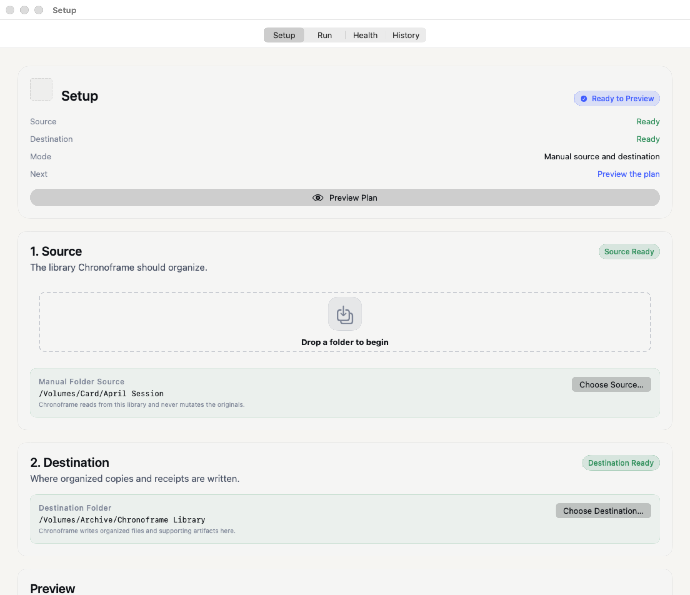
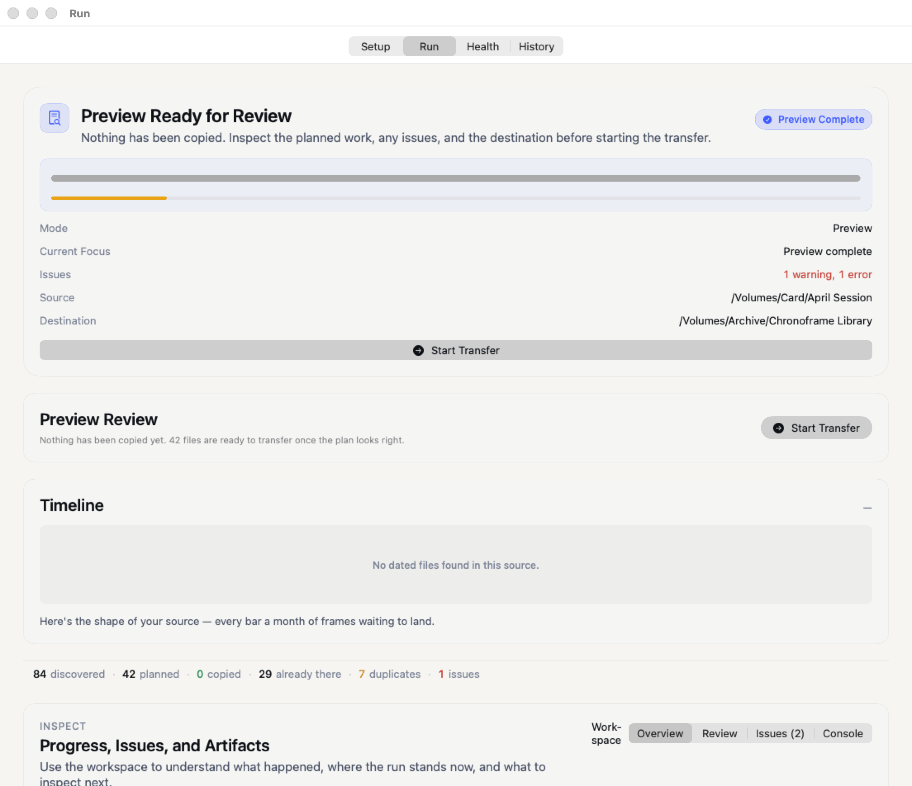

# Chronoframe

[](https://github.com/Nishith/Chronoframe/releases/latest)
[](LICENSE)

**Organize messy photo folders without changing your source files, then clean up duplicates safely through Trash.**

Chronoframe is a macOS app for people with years of photos and videos spread across phones, camera cards, old laptops, external drives, and backup folders. It helps you build a cleaner library in two practical ways:

- **Organize** copies scattered media into a date-based folder structure.
- **Deduplicate** finds exact copies and similar shots so you can choose what to keep.

Chronoframe always shows you a plan before it changes anything. Your source folder is read-only, transfers can be reviewed before copying, and dedupe choices move files to the macOS Trash instead of permanently deleting them.

|  |  |
| :---: | :---: |
| Choose folders and layout | Preview before copying |

## What You Can Do

| Need | Use Chronoframe to |
| :--- | :--- |
| Make sense of a messy folder | Copy photos and videos into folders like `2024/06/15` |
| Combine old backups | Skip files that are already in the destination |
| Fix uncertain dates | Review unknown or low-confidence dates before copying |
| Clean up duplicate files | Find exact copies by content, not filename |
| Compare similar shots | Review near-duplicates, bursts, RAW+JPEG pairs, and Live Photos |
| Undo a transfer | Revert copied files from History when their contents still match the receipt |

## Safety First

- **Originals stay untouched.** Chronoframe reads the source folder but does not move, rename, edit, or delete source files.
- **You approve the plan.** Organize shows what will copy before transfer. Deduplicate shows what will move to Trash before commit.
- **No overwrites.** If a destination filename already exists, Chronoframe creates a distinct name.
- **Copies are checked.** Transfers are written safely and verified by default.
- **Trash, not hard delete.** Deduplicate sends selected files to the macOS Trash.
- **Receipts are kept.** History records what happened so you can inspect or revert supported runs.

## Install

1. Download `Chronoframe.zip` from the [Releases page](https://github.com/Nishith/Chronoframe/releases).
2. Unzip it.
3. Drag `Chronoframe.app` to Applications.
4. Open the app.

Chronoframe requires **macOS 13.0 or later** and enough free space for the organized copy of your library.

If macOS blocks the app on first launch, right-click `Chronoframe.app`, choose **Open**, then confirm.

## Organize Photos

1. Open **Organize**.
2. Choose the folder with your unsorted photos and videos.
3. Choose a destination folder.
4. Pick a folder layout.
5. Click **Preview**.
6. Review anything that needs attention, such as unknown dates or skipped files.
7. Click **Transfer** when the preview looks right.

Chronoframe copies files into the destination. It does not remove anything from the source.

## Deduplicate Photos

1. Open **Deduplicate**.
2. Choose the folder to scan, or use the same destination as Organize.
3. Click **Scan**.
4. Review each duplicate group and choose what to keep.
5. Click **Commit** to move selected duplicates to Trash.

Exact duplicates can be suggested automatically. Similar photos, bursts, RAW+JPEG pairs, and Live Photo pairs stay reviewable so you can make the final call.

## Helpful Guides

- [Quick Start](docs/QUICK_START.md) for a short walkthrough.
- [FAQ](docs/FAQ.md) for common questions.
- [Troubleshooting](docs/TROUBLESHOOTING.md) for installation, permission, preview, transfer, and dedupe issues.
- [Technical Documentation](docs/TECHNICAL.md) for command-line use, architecture, generated files, build commands, and developer notes.

## Command Line

Developers can run the Swift CLI through SwiftPM:

```bash
swift run --package-path ui ChronoframeCLI --source ~/Photos/Unsorted --dest ~/Photos/Organized --dry-run
```

## Privacy

Chronoframe works on folders you choose on your Mac. It does not upload your photo library. Its cache, reports, and receipts are stored inside the destination folder so you can inspect or remove them when you no longer need them.
