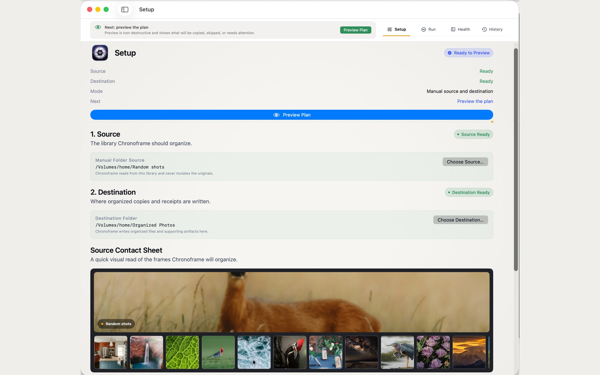
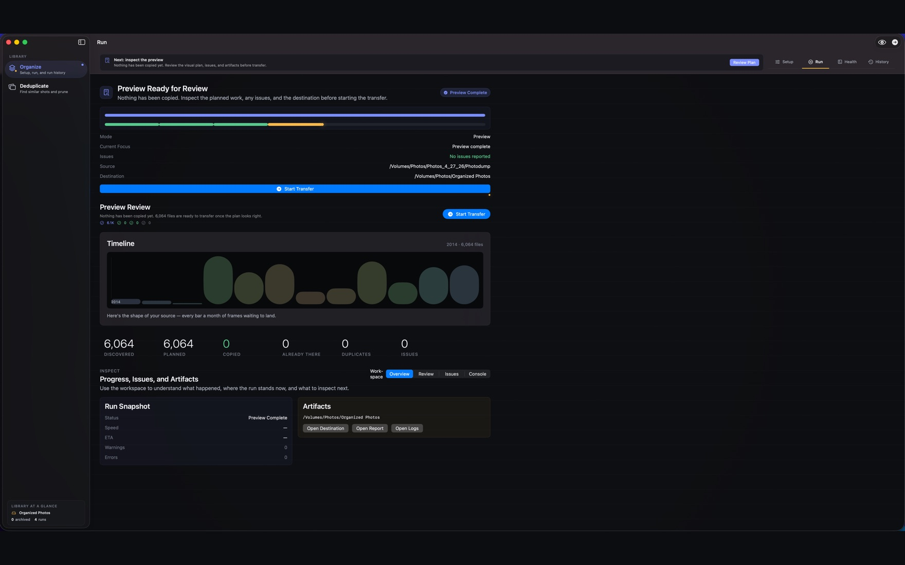
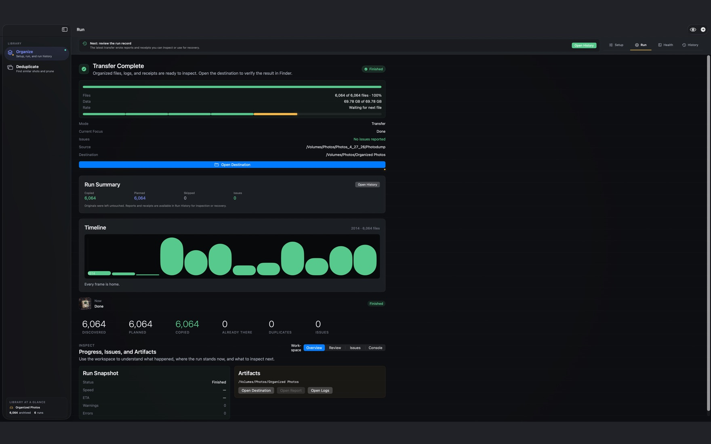
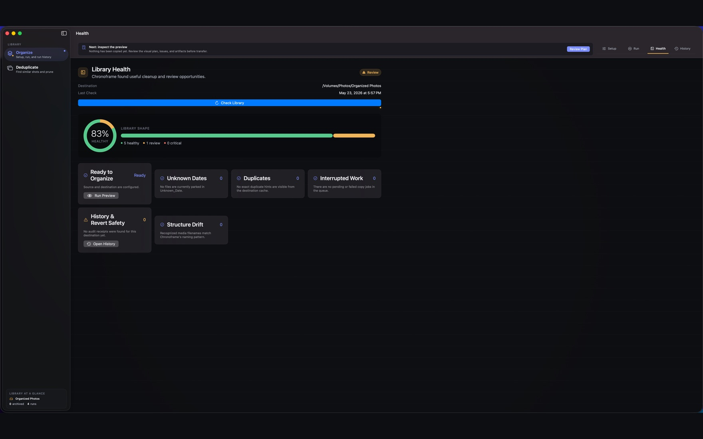
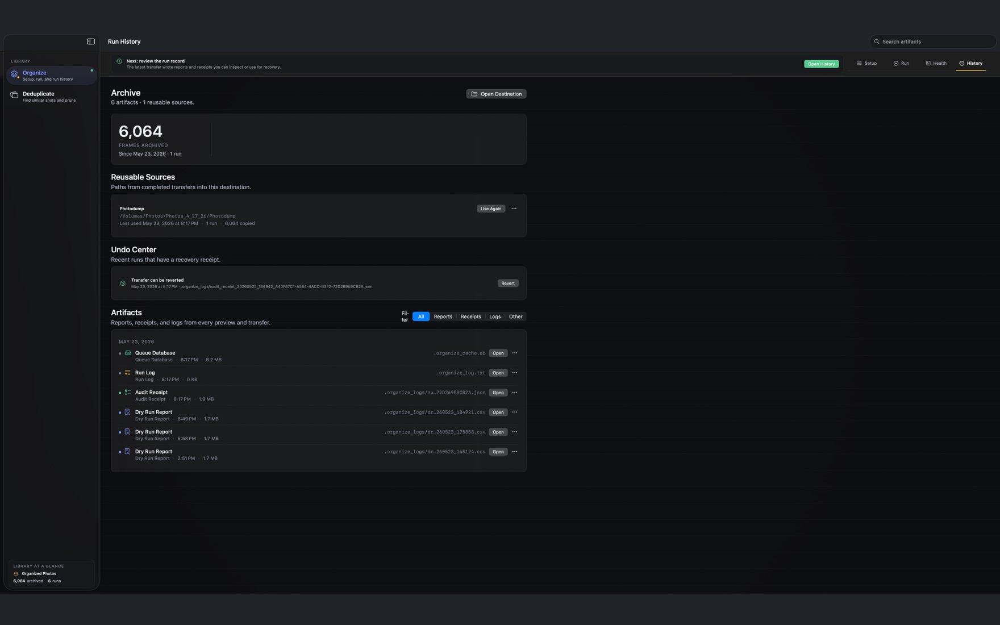
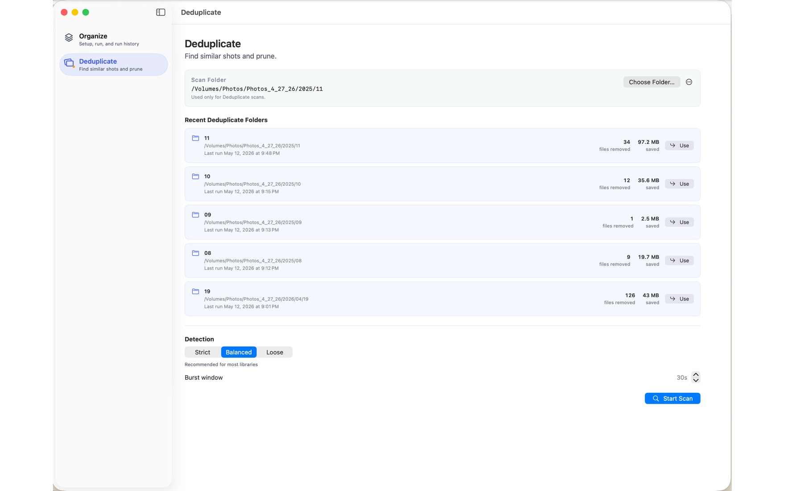
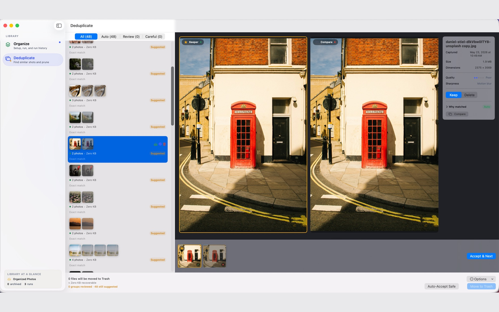

# Chronoframe

[](https://github.com/Nishith/Chronoframe/releases/latest)
[](LICENSE)

**Organize messy photo and video folders without changing your source files, then clean up duplicates safely through Trash.**

Chronoframe is a macOS app for people with years of photos and videos spread across phones, camera cards, old laptops, external drives, and backup folders. It helps you build a cleaner library in two practical ways:

- **Organize** copies scattered media into a date-based folder structure.
- **Deduplicate** finds exact photo and video copies plus similar photos so you can choose what to keep.

Chronoframe always shows you a plan before it changes anything. Your source folder is read-only, transfers can be reviewed before copying, and dedupe choices move files to the macOS Trash instead of permanently deleting them. Durable receipts and recovery state help Chronoframe reconcile interrupted work without guessing.



## What You Can Do

| Need | Use Chronoframe to |
| :--- | :--- |
| Make sense of a messy folder | Copy photos and videos into folders like `2024/06/15` |
| Combine old backups | Skip files that are already in the destination |
| Fix uncertain dates | Review unknown or low-confidence dates before copying |
| Keep an eye on the library | Run a Health check for unknown dates, duplicates, and interrupted work |
| Clean up duplicate files | Find exact photo and video copies by content, not filename |
| Compare similar shots | Review near-duplicate photos, bursts, RAW+JPEG pairs, and Live Photos |
| Change the library layout | Safely reorganize an existing destination into a new date structure |
| Undo a supported run | Revert transfers, dedupe commits, and reorganize runs from History when their receipts still match |
| Recover after an interruption | Reconcile recorded work on relaunch, or show exactly when a drive or manual action is needed |

## Safety First

- **Originals stay untouched.** Chronoframe reads the source folder but does not move, rename, edit, or delete source files.
- **You approve the plan.** Organize shows what will copy before transfer. Deduplicate shows what will move to Trash before commit.
- **No overwrites.** If a destination filename already exists, Chronoframe creates a distinct name.
- **Copies are checked.** Transfers are written safely and verified by default.
- **Trash, not hard delete.** Deduplicate sends selected files to the macOS Trash.
- **The preview and commit agree.** Deduplicate executes the same immutable, content-verified plan shown in the commit summary.
- **One operation at a time.** The app, CLI, and system integrations cannot mutate the same destination concurrently. This guard works per-machine; running Chronoframe from two Macs against the same network/NAS folder at once is not supported, and the app warns you when a destination is on a network drive.
- **Receipts are kept.** History records what happened so you can inspect, recover, or revert supported runs.
- **Ambiguity stops the run.** Changed files, missing recovery evidence, and unavailable drives fail closed instead of being guessed away.

## Install

[Download Chronoframe from the Mac App Store](https://apps.apple.com/us/app/chronoframe/id6771245052?mt=12). It is a one-time purchase with no subscription, account, analytics, or uploads.

The current source targets **macOS 14.0 or later** on Apple Silicon and Intel Macs. Organizing also requires enough free space for a copy of the source library.

## Organize Photos

Organize is a four-step workspace — **Setup**, **Run**, **Health**, and **History** — that you move through left to right.

1. Open **Organize → Setup**.
2. Click **Choose Source…** and pick the folder with your unsorted photos and videos.
3. Click **Choose Destination…** and pick where organized copies should go.
4. Click **Preview Plan**. Chronoframe scans the source, resolves dates, and builds a transfer plan — nothing is copied yet.



5. On the **Run** tab, inspect the preview: the timeline shows your library by month, and the counts cover what's ready, what's already there, duplicates, and anything that needs attention. Open **Review** to fix uncertain dates.
6. Click **Start Transfer** when the preview looks right. Chronoframe copies files into the destination, verifies them, and writes a receipt — your source is never touched.



### Check your library's health

The **Health** tab scans the destination on demand and surfaces cleanup opportunities — unknown dates, duplicates, interrupted work, structure drift, and revert safety — with a one-glance health score and shortcuts to act on each.



### Review and undo from History

The **History** tab keeps every run's reports and receipts. Reuse a past source, inspect logs, or open the **Undo Center** to revert a transfer, dedupe commit, or reorganize run when its files still match the receipt. If a run was interrupted, History distinguishes work that was recovered from work that needs a drive reconnected or manual attention.



## Deduplicate Photos and Videos

1. Open **Deduplicate**.
2. Click **Choose Folder…** to pick the folder to scan, or reuse a recent one. Pick a **Detection** preset (Strict, Balanced, or Loose) and click **Start Scan**.



3. Review each group. Compare candidates side by side, choose what to **Keep**, and use **Accept & Next** to move through them. **Auto-Accept Safe** clears the obvious exact copies for you.
4. Click **Move to Trash** to send the files you approved to the macOS Trash.



Exact photo and video duplicates are matched by file content and can be accepted automatically. Similar-photo groups, bursts, RAW+JPEG pairs, and Live Photo pairs stay reviewable so you can make the final call. Visual matching for video transcodes and re-exports is available as an off-by-default option in **Settings → Deduplicate**; those video matches are always review-only. Before Trash, Chronoframe rechecks each planned file and preserves pair units when anything changed after the scan.

## Helpful Guides

- [Quick Start](docs/QUICK_START.md) for a short walkthrough.
- [FAQ](docs/FAQ.md) for common questions.
- [Troubleshooting](docs/TROUBLESHOOTING.md) for installation, permission, preview, transfer, and dedupe issues.
- [Safety and Recovery](docs/SAFETY_AND_RECOVERY.md) for the exact guarantees, interruption states, and on-disk evidence.
- [Technical Documentation](docs/TECHNICAL.md) for command-line use, architecture, generated files, build commands, and developer notes.

## Command Line

Chronoframe is fully native Swift. Developers can run the shared organizing engine through the SwiftPM CLI:

```bash
swift run --package-path ui ChronoframeCLI --source ~/Photos/Unsorted --dest ~/Photos/Organized --dry-run
```

Run the full test suite with the sandbox-friendly cache setup used by the project:

```bash
/bin/zsh -lc "HOME=$PWD/.tmp/home XDG_CACHE_HOME=$PWD/.tmp/home/Library/Caches CLANG_MODULE_CACHE_PATH=$PWD/.tmp/modulecache SWIFTPM_MODULECACHE_OVERRIDE=$PWD/.tmp/modulecache swift test --package-path ui"
```

## Privacy

Chronoframe works on folders you choose on your Mac. It does not upload your photo library. Its cache, journals, reports, and receipts are stored inside the destination folder so you can inspect them and retain recovery evidence for as long as you need it.

See the [privacy policy](docs/PRIVACY_POLICY.md) and [Mac App Store release checklist](docs/APP_STORE_RELEASE.md) for release-readiness details.
