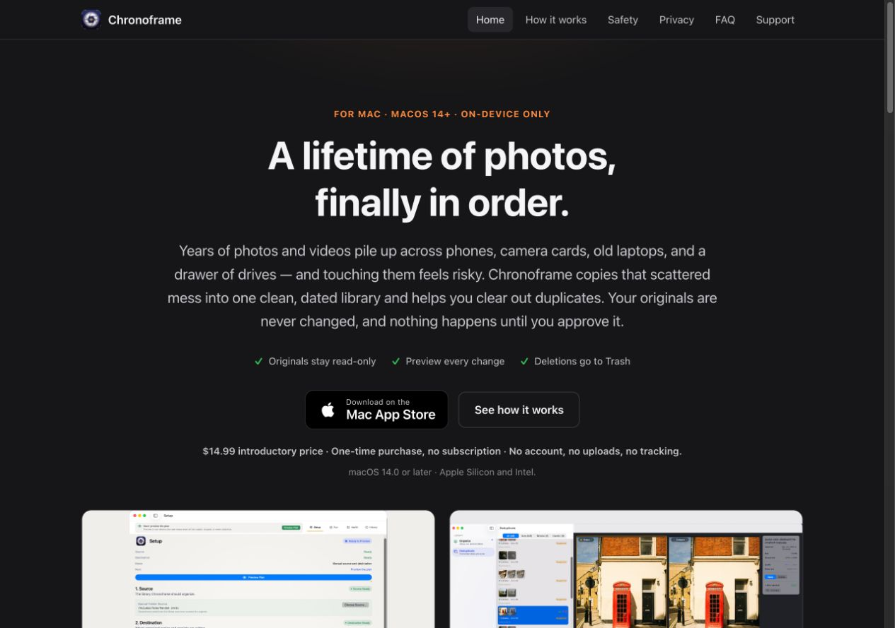
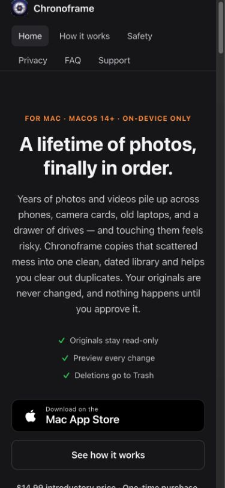
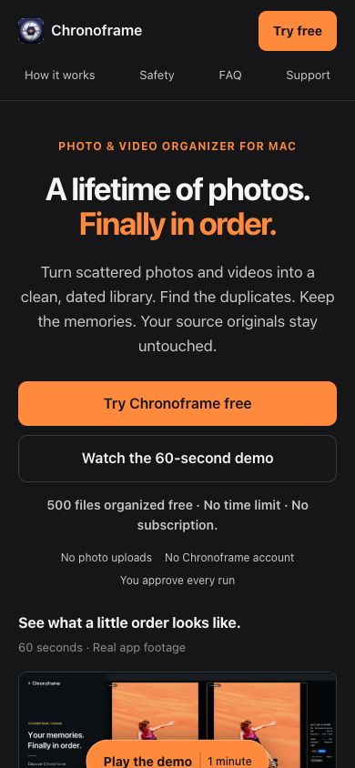
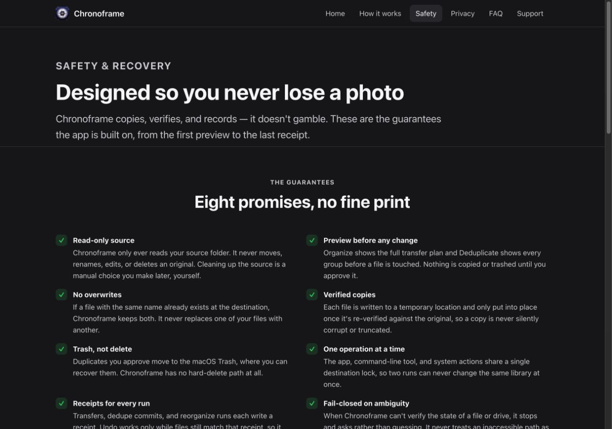
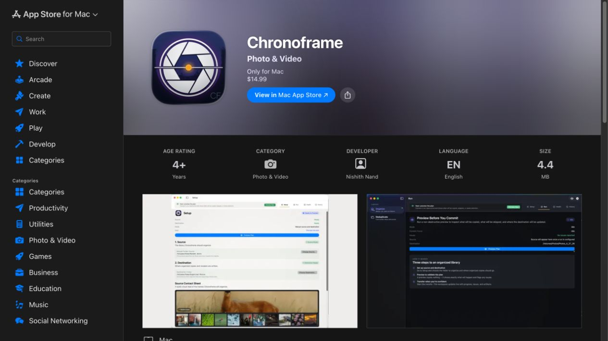
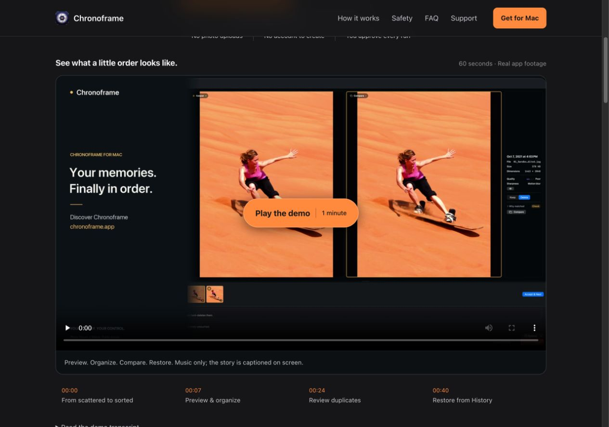
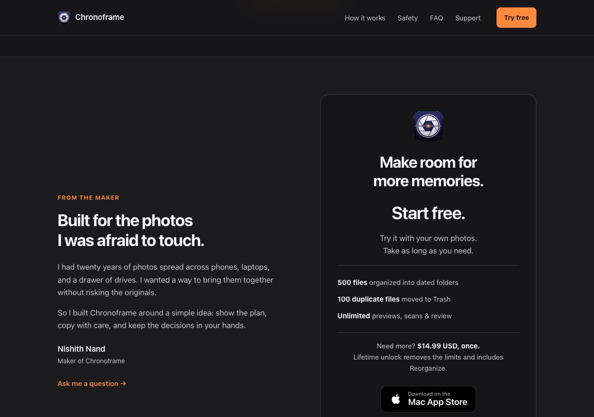
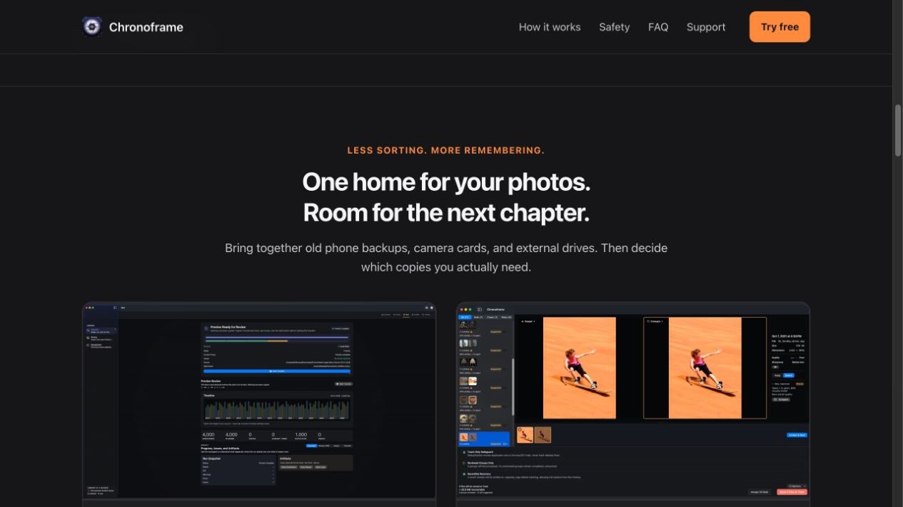

# Chronoframe website: critical review and implemented improvements

Reviewed September 27–28, 2026. Scope: the live website, the complete tracked `site/`
source, Pages deployment checks, the existing demo exports, and the public US Mac App
Store listing, plus the upcoming trial release requested by the owner. Goal: help a prospective Mac customer understand the product, trust its
workflow, and make an informed purchase with fewer detours.

The original site had the right differentiator—care for irreplaceable originals—but
made visitors read repeated assurances before seeing enough evidence. It felt more
like a product explanation than a confident invitation to use the app. The changes
make the real product demonstration the center of the buying journey while keeping
the existing dark Meridian theme, static architecture, and privacy promise.

These are design and conversion hypotheses, not measured sales results. No conversion
baseline, customer interviews, or App Store Connect analytics were available in this review.

## Journey and evidence

1. **Arrive on the homepage.** Identify what the app does, whether it is for Mac, and what
   to do next. Captured the live page at desktop and phone widths. The long hero,
   wrapped navigation, and repeated reassurance pushed product evidence and pricing down.
2. **Understand the workflow.** Follow “How it works.” The existing real screenshots and
   distinct Organize/Deduplicate flows were useful, but the next step was another long
   read. There was no playable demonstration.
3. **Resolve risk and purchase objections.** Inspect Safety and expand the FAQ. The
   source-copy promise was valuable, but some guarantees exceeded actual behavior.
   The cost answer did not quote a price; the homepage had no inline buying FAQ.
4. **Reach the store.** Open the actual purchase destination. The live US listing was
   $14.99 upfront, supported Family Sharing, and stated macOS 13+. The development
   package requires macOS 14+. The owner subsequently requested copy for tomorrow’s
   free-download/trial release, so the implemented offer targets that release. It must
   ship alongside the store cutover, not ahead of it.
5. **Verify the changed experience.** Exercise the local page at 1280, 390, and 320 pixels;
   play the real film, seek chapters from a cold load, use keyboard controls, expand
   questions, and follow the final purchase link to the same $14.99 listing.

### 1. Homepage before

The visual identity was coherent and there were real app screenshots. However, the
paragraph tried to explain the problem, the product, its two modes, and all its safety
claims at once. Six equally prominent navigation links provided no purchase action.
The screenshot pair demonstrated UI, but not the sequence or confidence of using it.

### 2. Mobile before and after

| Live page, 390 × 844 | Revised page, 390 × 844 |
| --- | --- |
|  |  |

The revised first screen exposes the free allowance and both next steps, with the demo beginning
below them. The compact header retains a purchase action as visitors explore. At 320
pixels, the layout also reflows without off-screen controls. This is desktop-browser
viewport testing, not a claim of physical iPhone testing.

### 3. Safety claims before

Absolute loss-prevention wording, universal verification, and unconditional concurrency
claims were especially risky for a product whose differentiation is trust. The underlying
code supports a more precise and still compelling explanation.

### 4. Store handoff

The [$14.99 US listing](https://apps.apple.com/us/app/chronoframe/id6771245052?mt=12)
was checked directly. The page did not have enough ratings to display an overview.
No invented ratings, quotes, savings, or customer counts were added. The site is now prepared for the forthcoming free download, with a separate $14.99 USD
lifetime unlock, regional variation, and clear trial limits. The documented launch price
is used provisionally; confirm it and the storefront cutover before merging.

### 5. New demo and purchase path

The finished 60-second horizontal film is the right website asset: it explains the
before/after, preview, transfer, duplicate decision, and recovery story. Its 1080p
export is only 6.9 MB, so it does not need a tracking-heavy third-party player or the
64.6 MB 4K master. Native playback remains available without JavaScript.

## Findings and resolutions

| Priority | Finding and consequence | Implemented response |
| --- | --- | --- |
| High | Product proof arrived late. The buyer had to imagine how the safety claims translated into actual use. | Added the existing film near the top, a clear play button, 60-second expectation, four chapter shortcuts, WebVTT, and a descriptive HTML transcript. |
| High | Long hero and repeated trust copy delayed understanding on phones. | Shortened the pitch, named the product category, separated purchase/watch actions, and used a clear amber action color. Kept the existing brand rather than introducing an unrelated visual system. |
| High | The old paid-upfront funnel cannot describe the upcoming trial release. | Led with a free download; stated 500 organized files, 100 files moved to Trash, no time limit, unlimited review, and the optional lifetime unlock. Detailed cumulative allowances, Reorganize, and existing-buyer restoration in the FAQ. |
| High | Safety copy overpromised: no-loss language, verification presented as unconditional, network locking framed as universal, recovery without clear Trash limits. | Qualified verification as on by default, described same-Mac locking and unsupported multi-host network use, clarified receipt/content/Trash conditions, and recommended independent backups. |
| High | The broad originals promise could be read as applying to a folder explicitly selected for Deduplicate. | Distinguished Organize’s read-only source from separately approved Trash operations in the scanned folder. |
| Medium | Savings language skipped a practical limitation: moving to Trash does not immediately reclaim its storage. | Added a homepage answer explaining that emptying Trash releases space and ends that recovery option. |
| Medium | Repetitive sections and the negative competitor passage weakened the maker’s story. | Replaced the feature inventory with two outcomes and a three-step starting path. Shortened the maker note to the original problem and design principle. |
| Medium | Questions about subscription, formats, Apple Photos, offline use, and required free space forced detours. | Added native inline disclosures on the homepage, with deeper FAQ and support links. Direct Apple Photos import is explained and explicitly distinguished from deletion inside Photos. |
| Medium | Mac compatibility differed between source, site, and the old store listing. | Targeted the upcoming release’s macOS 14+ requirement consistently. Documented that publishing waits for the matching free-download release. |
| Medium | Metadata described the product but did not expose the new video or offer structurally. | Added descriptive category/title copy plus SoftwareApplication and VideoObject JSON-LD, without fabricated ratings. Updated sitemap dates and versioned CSS/JS references. Search appearance is not guaranteed. |
| Medium | Deployment checked that named files existed but could publish broken relative links or omitted media. | Added dependency-free validation of all nine HTML pages, local targets/fragments/assets, basic semantics, metadata, sitemap, video loading policy, size, fast-start atoms, and caption timings. Runs on PRs and before deployment. |
| Low | Header/footer repetition and inconsistent action hierarchy added noise. | Shared compact navigation, visible store action, purposeful footer links, and a dedicated price/maker section. All existing public routes remain. |

## Release feature decisions

- **Promote Apple Photos import:** it removes an export chore and opens an obvious entry
  point for Mac users. Explain original/unedited resources, read-only access, iCloud
  downloads, and staging space. Never imply deduplication inside Apple Photos.
- **Promote watched sources:** useful for keeping a library organized after the first
  run. Call counts estimates and imports review-gated; do not imply unattended imports.
- **Explain similar-video matching:** a concrete reason to return to duplicate review.
  Keep opt-in, additional analysis, and mandatory review visible.
- **Do not promote Library Guardian:** `GuardianCapability.isEnabled` is false and the
  release remediation notes explicitly keep it disabled. Integrity scans, verified
  mirrors, and restore should wait for the actual enabled release.
- **Keep the trial specific:** `TrialAllowanceCaps.standard` is 500/100 lifetime files;
  preview, scan/review, CSV, Health and History are unlimited. Revert is ungated and
  refunds successfully undone work. Reorganize requires the unlock. Existing paid buyers
  keep full access. StoreKit networking belongs in privacy/offline explanations.

## Code and accessibility review

The existing static architecture is an advantage. There is no reason to introduce a
framework, build service, external font, tracking script, or video embed for this page.
The only new production JavaScript enhances playback; HTML still provides the content,
native video controls, captions, transcript, disclosures, navigation, and purchase links.
Chapter controls start hidden and become available only when the script runs. Playback
is user-initiated, with a visible fallback if media loading or play fails.

Preserved or improved: one h1 per page, page language, alt text, intrinsic image/video
dimensions, visible keyboard focus, a focusable skip-link destination, semantic lists,
native details/summary, at least 44-pixel main navigation and action targets, reduced-motion
handling, and a forced-colors border treatment for custom controls. The inspected text
color pairs meet 4.5:1: muted text on panel 5.04:1, secondary text on the trust surface
10.20:1, dark text on amber 7.71:1, white text on the revised indigo 5.76:1.

No claim of full WCAG conformance is made. Remaining accessibility checks include a
complete VoiceOver reading-order pass, real Safari/iPhone/Firefox testing, caption-menu
interaction across browsers, and user testing. Browser captions were present as an
English text track; cue syntax and timing were validated. The HTML transcript also
describes the visual actions because there is no spoken narration.

## Validation

- `python3 script/check_site.py`: passed for nine pages and all deployed references.
- `node --check site/site.js`: passed.
- FFmpeg full decode of the deployed MP4: no errors; SHA-256 matches the original export.
- MP4 is 1920 × 1080 H.264/AAC, about 60.07 seconds including encoder priming, fast-start,
  6,874,782 bytes. Poster is the existing 1280 × 720 export.
- Browser checks: initial video readyState 0 (no eager media load); keyboard-initiated
  playback; cold chapter navigation; subsequent chapter seeking; pause; transcript and
  FAQ disclosure; skip-link focus; purchase link reaches the correct App Store page.
- Visual reflow at 1280, 390, and 320 pixels; no right-edge overflow at 320 pixels.
- A preview-server issue was found and fixed: standard Python http.server lacks byte
  ranges, so native chapter seeking reset to zero. `script/preview_site.py` supports
  byte ranges and the browser verified a seekable range covering the full film.
- `git diff --check`: passed. No Swift app code changed; Swift tests were not needed.

## Highest-value follow-through

1. **Align the App Store product page with the website and the exact release being sold.**
   Upload the prepared App Store preview through the existing release process, refresh
   screenshots when the corresponding build ships, and resolve the macOS 13/14 mismatch.
   The source tree is not evidence that a feature is already available to a new buyer.
   This PR is prepared for the free allowance. Merge only when that offer is actually
   available. The owner’s launch timing may supersede the older seven-day transition
   in `docs/free-trial-plan.md`; resolve that scheduling difference before deployment.
2. **Measure purchases, not just page activity.** Establish a baseline in App Store Connect,
   configure owner-issued campaign links for distinct acquisition channels, and compare
   product-page views and purchases over comparable periods. Avoid adding behavioral
   tracking to a site selling privacy. This change has not demonstrated a conversion lift.
3. **Publish useful acquisition content after fact-checking it.** Local guide drafts exist
   outside tracked main, but use older markup and should be reconciled with the actual
   shipped workflow before being included in navigation and the sitemap. Prioritize
   specific tasks—merging drive backups and finding duplicates safely—over generic SEO copy.
4. **Collect real proof over time.** With permission, add a genuine customer quote or a
   reproducible library case study with the source, settings, time, and result disclosed.
   Until then, the actual app demonstration is better evidence than invented metrics.

The website changes are reviewable independently of the ongoing app/release work.
Publishing still happens through the repository’s existing main → GitHub Pages workflow.

## Screenshot correction after owner review

The initial website pass retained the seven older light-interface product images.
That was a review miss: the newer video and release copy made the mismatch more visible.
The five active illustrated workflows now use the approved September marketing captures,
with source digests in `site/assets/screenshots/provenance.json`. These are existing
captures, not freshly recorded final-trial-build screens. Setup was compared with the
September 27 local development build. The old Health and detection-setup illustrations
were removed from the page while retaining their explanations.

Image descriptions now match the actual 4,000-file demo and sandboarding comparison.
New filenames prevent the browser from reusing old image caches. The former cover
sizing cropped controls at different aspect ratios; contain sizing preserves the whole
window, and linked images allow full-resolution inspection. Trial counts are described
in text, not painted onto screenshots. The page identifies the full-access demo context.

